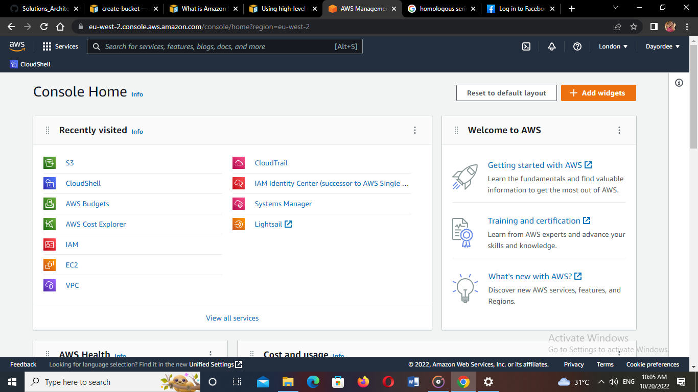
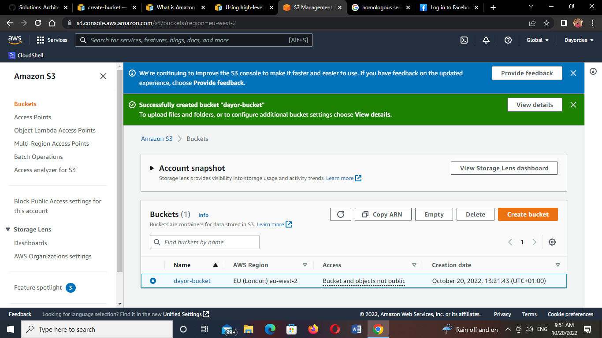
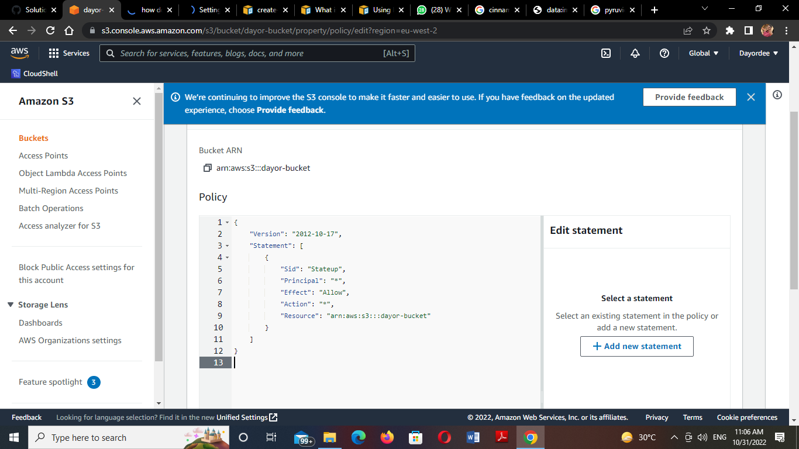
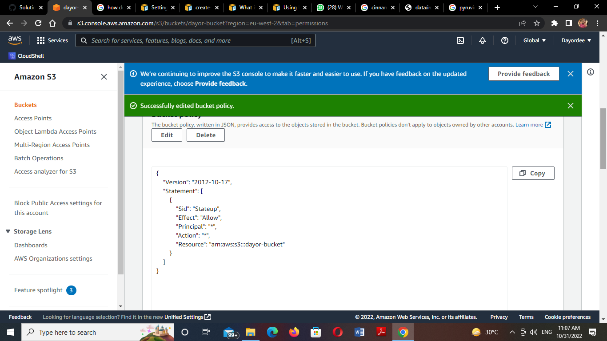
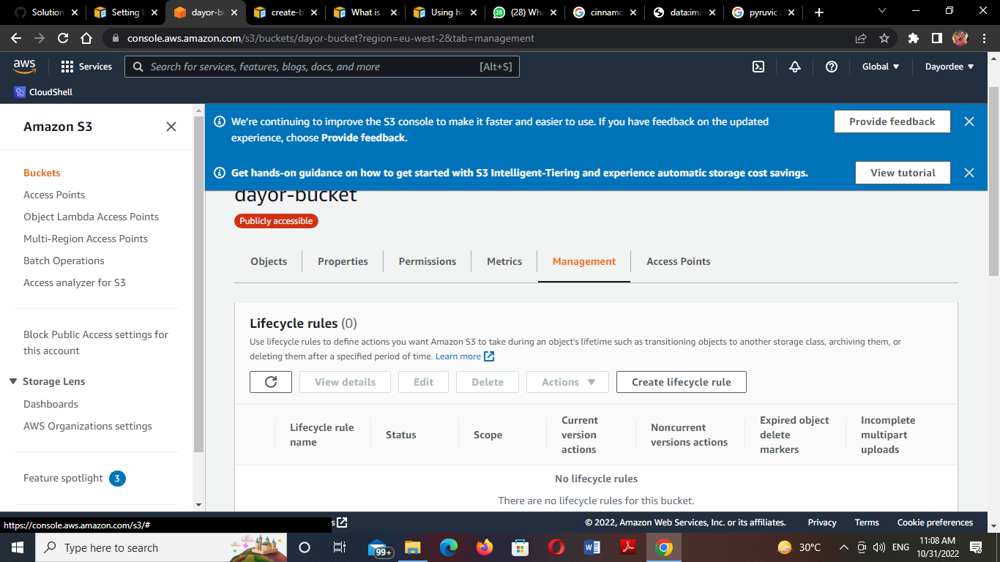
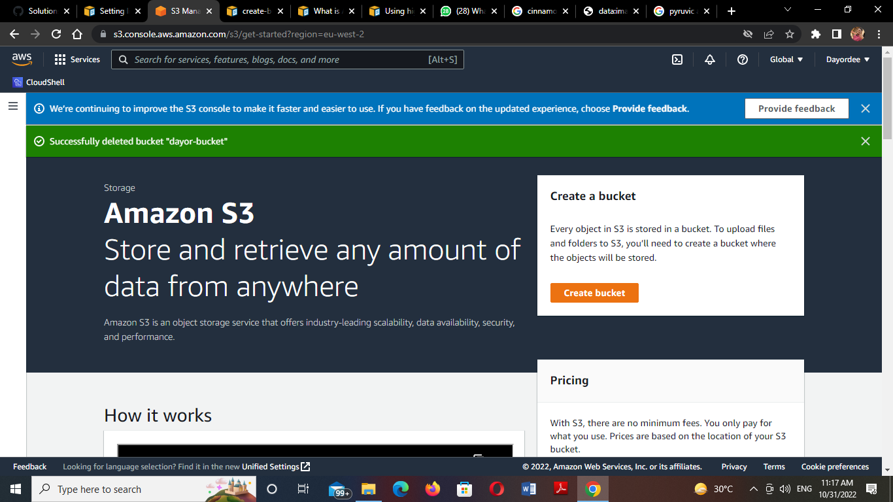

# Task 2: Create Amazon S3 bucket with bucket policies and life cycle management

1. Launch AWS Console
2. Create a S3 bucket with enforced ownership
3. Create a single lifecycle policy
4. Create a single bucket policy
5. Delete all policies
6. Delete S3 bucket

For guide, kindly visit

https://docs.aws.amazon.com/cli/latest/reference/s3api/create-bucket.html

https://docs.aws.amazon.com/AmazonS3/latest/userguide/Welcome.html

https://docs.aws.amazon.com/cli/latest/userguide/cli-services-s3-commands.html

1. I launched my AWS console

2.I created a bucket with an enforced ownership

3. I created a single life-cycle policy

4. I created a single bucket policy

5. Delete all policies

6. Delete S3 bucket

