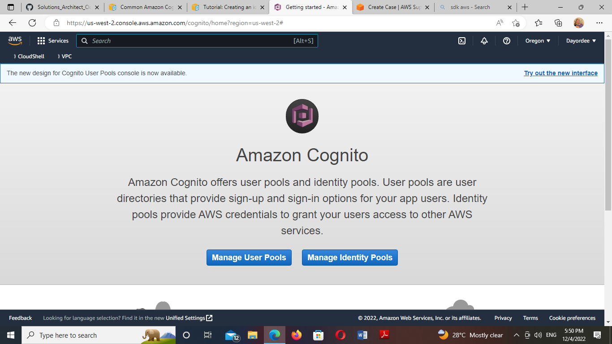
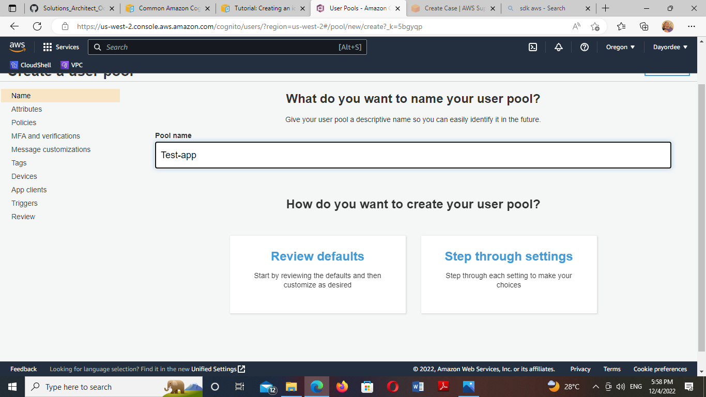
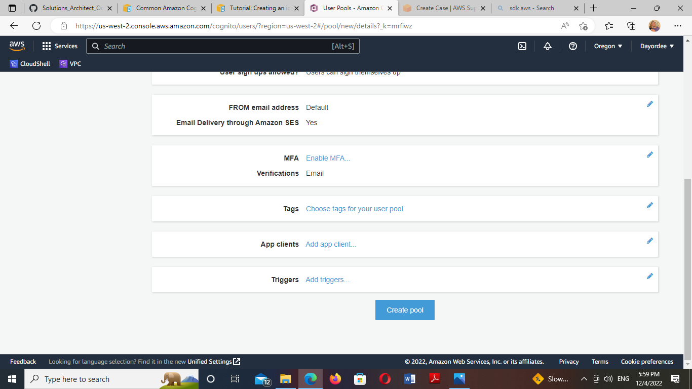
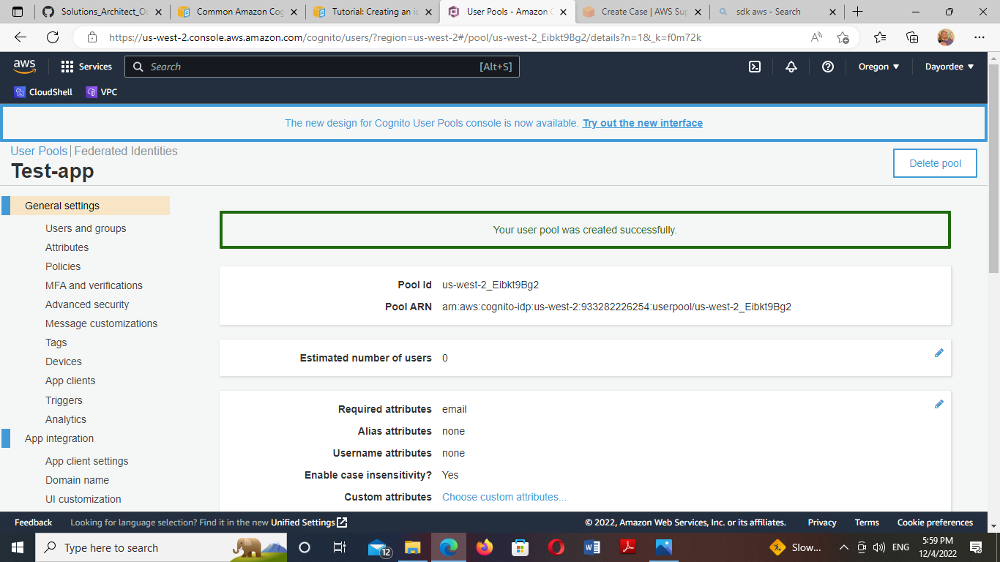

Creating a User Pool

Tasks: 
1. Go to the Amazon Cognito console. 
2. Choose Manage User Pools.
3. Choose Create a user pool.
4. Enter a name for your user pool and choose Review defaults to save the name.
5. On the Review page, choose Create pool.

Guide:

https://docs.aws.amazon.com/cognito/latest/developerguide/cognito-scenarios.html

https://docs.aws.amazon.com/cognito/latest/developerguide/tutorial-create-identity-pool.

1. I  got to the Amazon Cognito console

2. I entered and chose Manage User Pools

3.   I created  a User 

4. I entered a name for  user pool ans chose review defaults to save the name

5. On the review page. I chose create pool

