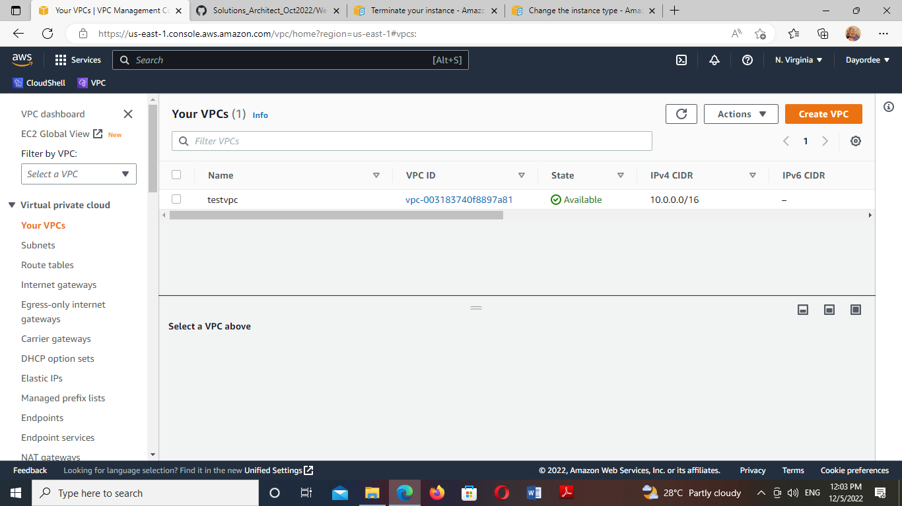
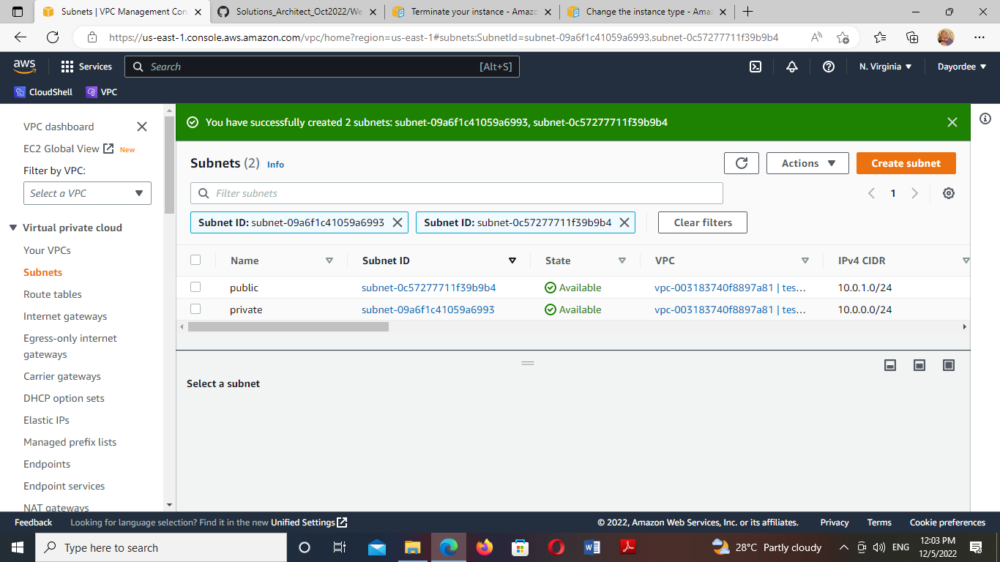
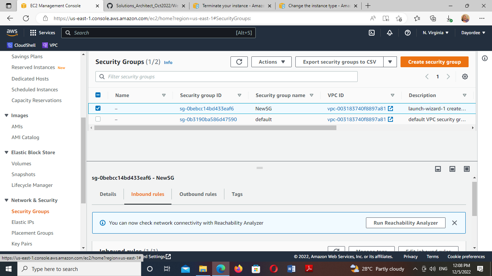
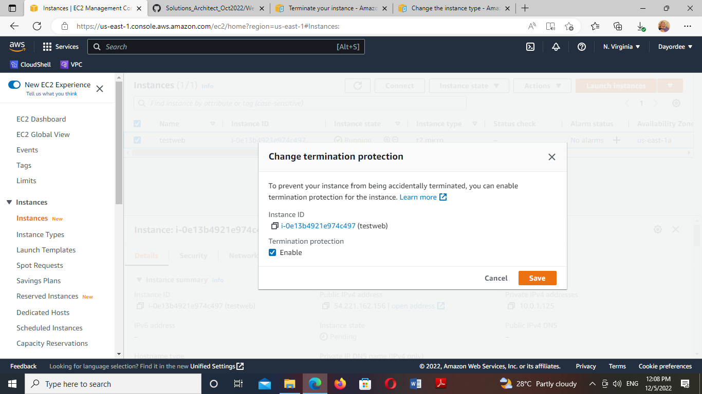
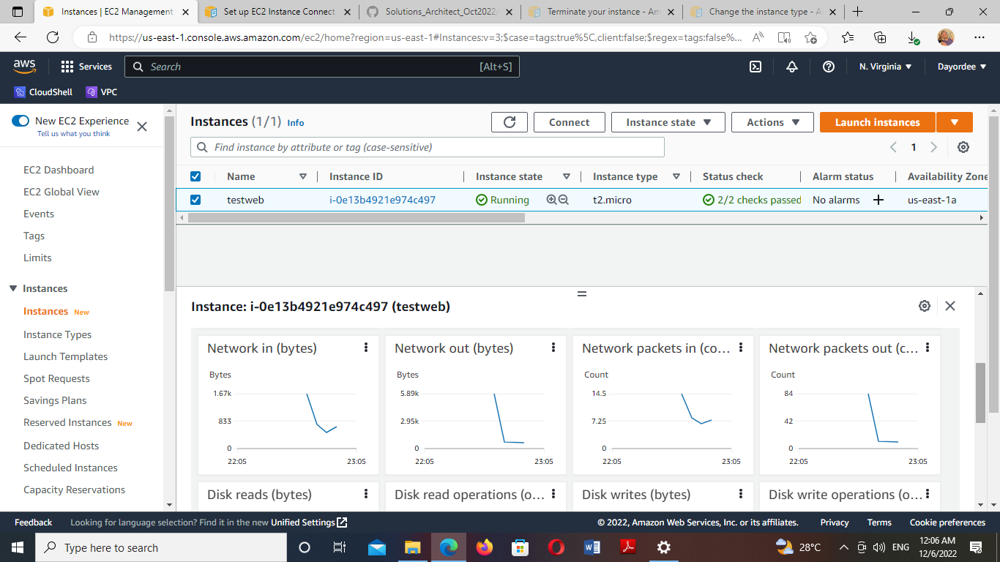
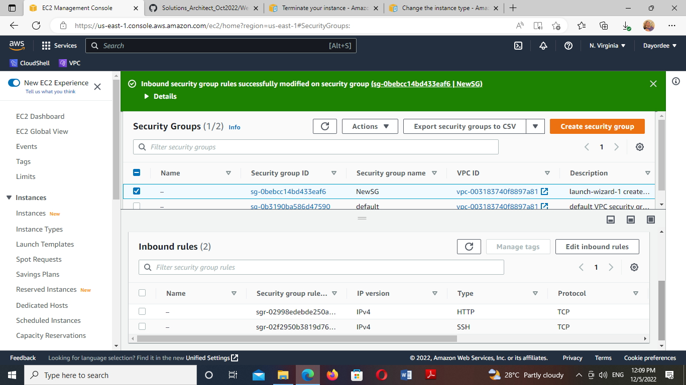

# Working with EC2 instance using the AWS CLI / Programmable access

Tasks:

1. Using your default vpc, find the public subnet
2. Create a security group
3. Launch an instance with a web server with termination protection enabled
4. Monitor Your EC2 instance; view the types of metrics that are collected for an EC2 instance
5. Modify the security group that your web server is using to allow HTTP access
6. Resize your Amazon EC2 instance to scale

Guide
https://docs.aws.amazon.com/AWSEC2/latest/UserGuide/terminating-instances.html

https://docs.aws.amazon.com/AWSEC2/latest/UserGuide/ec2-instance-resize.html

1. through my VPC   I found my  subnet

2. I created a security group

3. I Launch an instance with a web server with termination protection enabled

4..png) and i viewed the metrics

5. I modified the security group with HTTP acces 

6.  I enable auto scaling group for my instance
.png)
.png)